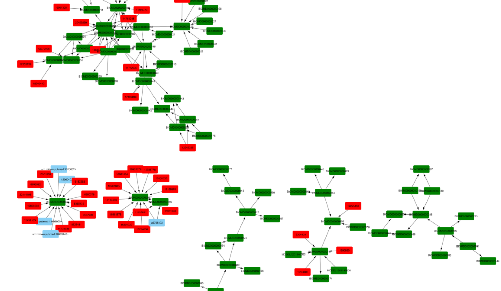
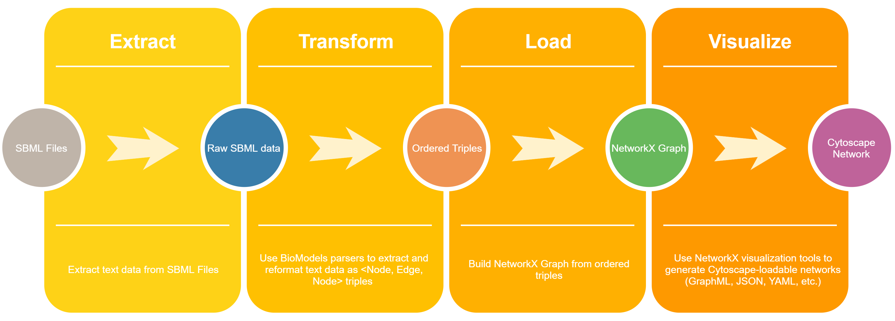

_**This project is under active development as part of semantic data research with
[UW BIME](http://bime.uw.edu/).**_

# BioModels-ETL

Biomodels-ETL is a customizable ETL pipeline and DAG engine for visualizing SBML 
[BioModels](https://www.ebi.ac.uk/biomodels/) (mathematical models for biological systems). 
It generates NetworkX DAGs that can be exported and visualized as semantic data networks.

Example network (visualized with Cytoscape):

Network showing parent-child relationships between derived BioModels 
(BioModels that name another model as its predecessor).
PubMed models are displayed in red, EBI models in green.

The pipeline:
- Extracts SBML data from SBML BioModels
- Parses data with user-implemented parsers/classifiers to retrieve semantic data as 
ordered triples (similar to RDF)
- Processes and loads ordered triples into a NetworkX DAG
- Exports DAG (most graph data formats e.g. JSON, YAML, GraphML, etc. are supported). 
Compatible with most network visualization tools.

The following flowchart illustrates this process:

Completed example networks are available [here](BioModelsETL/graphs).

## Dependencies

[NetworkX](https://networkx.github.io/), [BeautifulSoup](https://pypi.org/project/beautifulsoup4/), 
[dateutil](https://github.com/dateutil/dateutil), [lxml](https://github.com/lxml/lxml),
[libSBML](https://github.com/opencor/libsbml)
